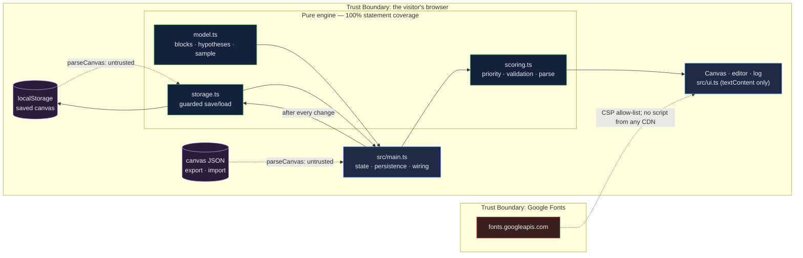

# Venture Canvas Studio: a lean canvas that knows which of its beliefs have been tested

[](https://github.com/Freddricklogan/venture-canvas-studio/actions/workflows/deploy.yml)
[](#5-getting-started--verification)
[](https://github.com/Freddricklogan/venture-canvas-studio/actions/workflows/codeql.yml)
[](LICENSE)
[](https://freddricklogan.github.io/venture-canvas-studio/)

## 1. Executive Summary & Business Impact

**Problem statement.** A lean canvas is filled in once, in an afternoon,
and then treated as a plan. Its nine blocks are beliefs, and the founder
who wrote them rarely records which have been tested, which failed, and
which the whole business depends on. The canvas that should drive the next
experiment becomes a slide.

**Solution & value delivered.** A canvas whose every block carries
falsifiable hypotheses, each scored for risk, confidence and effort. An
experiment log records the success criterion *before* the result, and the
latest outcome sets the hypothesis's status. A "test next" list ranks what
to do this week by risk × uncertainty ÷ effort; block badges show how much
risk is still at stake; an invalidated high-risk hypothesis is flagged as a
pivot signal rather than buried. The canvas is saved in the browser after
every change and can be exported, imported and printed. The sample canvas
is the credential platform I am actually working on.

**[→ Read the full case study](docs/CASE_STUDY.md)**

| Outcome | How this repo delivers it |
| --- | --- |
| Beliefs stated so they can be wrong | Hypotheses live on blocks with a required one-sentence statement and 1–5 risk, confidence, effort |
| Experiments that cannot be rationalised after the fact | The success criterion is a required field recorded with the result; validation checks it is present |
| This week's work, ranked | `testNext()` orders untested and inconclusive hypotheses by risk × (6 − confidence) ÷ effort |
| Pivot signals, not footnotes | An invalidated hypothesis with risk ≥ 4 is surfaced in the summary |
| Yours to keep | localStorage save with honest reporting when storage is absent or full; JSON export/import with validation; print stylesheet |

## 2. Demonstrated Competencies & Technical Skills

- **Systems Architecture & CS** — strict TypeScript; scoring and parsing
  are pure and tested; a storage adapter with an injectable interface so
  absent, throwing and corrupt storage are all covered by tests.
- **Data Science & AI** — n/a. Priority is a stated formula, not a model.
- **Cybersecurity & Compliance** — strict CSP, no CDN scripts; everything
  the user types is stored and re-rendered through `textContent` only; the
  JSON importer treats saved data as untrusted and drops invalid hypotheses
  with warnings; typed ESLint, CodeQL and Trivy in CI.
- **EdTech & Human-Centered Design** — built for the venture-creation
  method I teach and use: the classic canvas layout, keyboard-operable
  hypothesis table, `aria-live` status, and a tour that records an
  experiment against the top-ranked hypothesis.

## 3. System Architecture & Data Flow



## 4. Technical Highlights & Engineering Decisions

### ADR-1 — The criterion is required, and it comes before the result

**Context.** The commonest failure in hypothesis testing is deciding what
"success" meant after seeing the data.

**Decision.** An experiment cannot be recorded without a success
criterion; the form field precedes the result and `validateHypothesis()`
rejects an experiment without one, in the importer as well as the form.

**Consequence.** The log is a record of predictions, not a diary. The
sample's invalidated hypothesis ("career offices hold the budget") shows
the criterion — three of six could approve — beside the result — two could.

### ADR-2 — Treat saved data as untrusted

**Context.** A canvas comes back from localStorage or an uploaded file,
either of which can be edited, truncated or malformed.

**Decision.** One parser (`parseCanvas`) handles both: it fills missing
blocks, drops hypotheses that fail validation with a warning naming them,
rejects duplicate ids, and never throws. Text is normalised and capped.

**Consequence.** A corrupt save loads the sample with a message instead of a
blank page; a hand-edited JSON with one bad row keeps the other rows.

### ADR-3 — Report whether the save happened

**Context.** localStorage can be absent (some private windows), full, or
blocked, and a page that silently fails to save loses a founder's work.

**Decision.** `saveCanvas()` returns `{ saved, reason }`; the page shows
"Saved in this browser" or "Not saved (reason) — export JSON to keep your
work" after every change. Storage is injected, so tests cover absent,
throwing and corrupt storage.

**Consequence.** The user always knows where their canvas lives.

## 5. Getting Started & Verification

**Prerequisites.** Node 22 LTS.

```bash
git clone https://github.com/Freddricklogan/venture-canvas-studio.git
cd venture-canvas-studio
npm install
npm run dev        # http://localhost:5173/venture-canvas-studio/
npm run check      # lint → typecheck → validate → test → build
```

**Verification — the numbers this repository actually produced:**

```bash
npm test         # Test Files 2 passed (2) · Tests 11 passed (11)
npm run coverage # All files 100% statements · 90.32% branches
npm run lint     # eslint (typed) — clean
npm run typecheck# tsc --noEmit — clean
npm run validate # html-validate index.html — clean
npm run build    # dist: no inline script or style
```

| Check | Result |
| --- | --- |
| Unit tests | **11 passed / 11** across 2 files |
| Statement coverage (engine) | **100%** (branches 90.32%) |
| ESLint (type-checked), `tsc --noEmit`, html-validate | clean |
| Headless Chrome smoke (built site) | **0 console errors**; sample 7 hypotheses, 1 validated / 1 invalidated, 20% risk-weighted validation, 1 pivot signal; tour step 3 records an experiment on the top-ranked hypothesis → 2 validated, 40%; the canvas persists to localStorage (7 hypotheses, 4 experiments after the tour); adding a hypothesis to Cost structure removes it from "blocks without a hypothesis"; an experiment without a criterion is blocked by the form; no horizontal scroll at 400 px |

## 6. Live Demo & Production Showcase

**<https://freddricklogan.github.io/venture-canvas-studio/>**

No account, no backend. The sample canvas is illustrative; your own is
saved only in your browser.

**30-second guided walkthrough.** Press **Take the 30-second tour**.

1. **Nine blocks, each with a badge** — validation per block.
2. **What to test next** — ranked by risk × uncertainty ÷ effort.
3. **Criterion before result** — records an experiment on the top item.
4. **Pivot signals** — the invalidated high-risk hypothesis in the sample.
5. **Yours to keep** — save, export, import, print.

Then press **New**, fill in your own canvas, and add a hypothesis to any
block.
